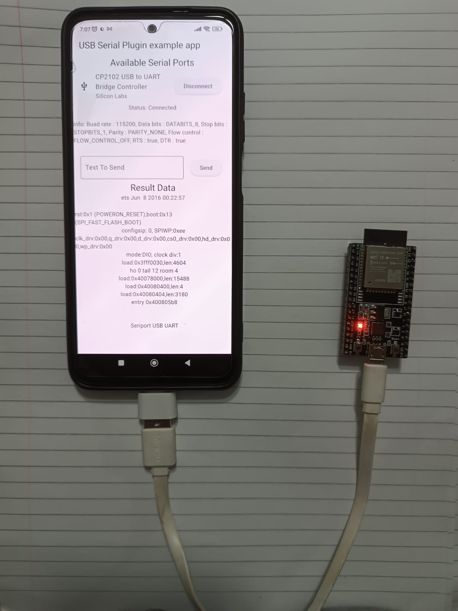
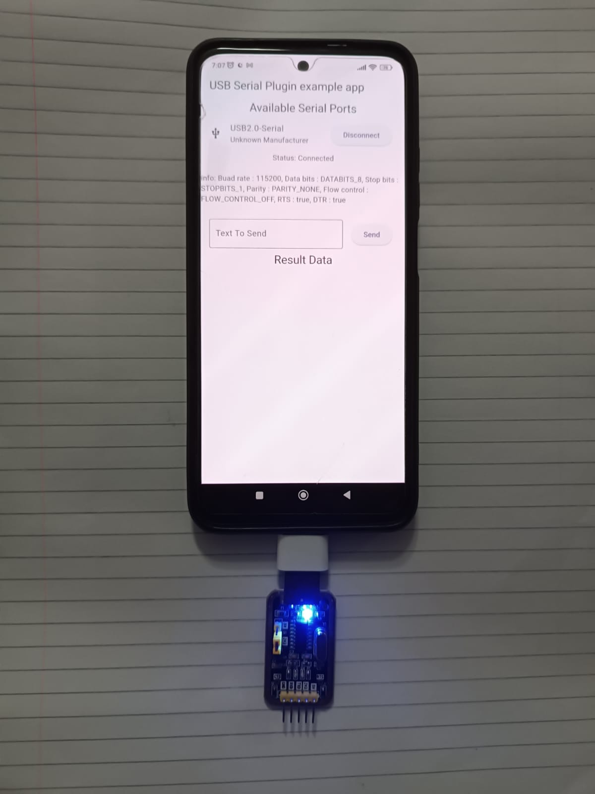

# ESP32 & FLUTTER USB SERIAL COMMUNICATION
A project that communicates with an ESP 32 and similar microcontroller via USB Serial


- ***Link headers***
  - [Gradle Settings](#1--gradle-settings)<br/>
  - [Console Codes](#2--console-codes)<br/>
  - [Device List XML File](#3--device-list-xml-file)<br/>
  - [Manifest Settings](#4--manifest-settings)<br/>
  - [Main Code](#5--main-code)<br/>
  - [Images](#6--images)<br/>


> [!NOTE]
> It is necessary to fulfill some steps for the Flutter project


### 1-) Gradle Settings
The contents of "android/build.gradle" are replaced with the following code. Versions may be variable.

```dart
buildscript {
    ext.kotlin_version = '1.8.22'
    repositories {
        google()
        mavenCentral()
    }

    dependencies {
        classpath 'com.android.tools.build:gradle:8.1.4'
        classpath "org.jetbrains.kotlin:kotlin-gradle-plugin:$kotlin_version"
    }
}

allprojects {
    repositories {
        google()
        mavenCentral()
    }
    // This code is where all the magic happens and fixes the error.
    subprojects {
        afterEvaluate { project ->
            if (project.hasProperty('android')) {
                project.android {
                    if (namespace == null) {
                        namespace project.group
                    }
                }
            }
        }
    }
    // This code is where all the magic happens and fixes the error.
}

rootProject.buildDir = '../build'
subprojects {
    project.buildDir = "${rootProject.buildDir}/${project.name}"
}
subprojects {
    project.evaluationDependsOn(':app')
}

tasks.register("clean", Delete) {
    delete rootProject.buildDir
}
```


### 2-) Console Codes
Enter this code into the console;
```dart
flutter pub add usb_serial
```
Or this line is added to the "pubspec.yaml" file;
```dart
dependencies:
  flutter:
    sdk: flutter

...
  cupertino_icons: ^1.0.8
  usb_serial: ^0.5.2 #We added this
```
After adding the library, the following commands are entered into the console respectivelyn;
```
flutter clean
flutter pub get
```


### 3-) Device List XML File
The [device_filter.xml](./Flutter_USB/android/app/src/main/res/xml/device_filter.xml) file is placed in the "/Flutter_USB/android/app/src/main/res/xml/" directory.
> [!NOTE]
> The XML folder may need to be created


### 4-) Manifest Settings
These lines are added to the "android/app/src/main/AndroidManifest.xml" file for notification and filtering;
```xml
<intent-filter>
  <action android:name="android.hardware.usb.action.USB_DEVICE_ATTACHED" />
</intent-filter>

<meta-data android:name="android.hardware.usb.action.USB_DEVICE_ATTACHED"
android:resource="@xml/device_filter" />
```


### 5-) Main Code
The following example "main.dart" code is written;
```dart
import 'dart:async';
import 'dart:typed_data';

import 'package:flutter/material.dart';
import 'package:usb_serial/transaction.dart';
import 'package:usb_serial/usb_serial.dart';

void main() => runApp(MyApp());

class MyApp extends StatefulWidget {
  @override
  _MyAppState createState() => _MyAppState();
}

class _MyAppState extends State<MyApp> {
  UsbPort? _port;
  String _status = "Idle";
  List<Widget> _ports = [];
  List<Widget> _serialData = [];

  StreamSubscription<String>? _subscription;
  Transaction<String>? _transaction;
  UsbDevice? _device;

  TextEditingController _textController = TextEditingController();

  Future<bool> _connectTo(device) async {
    _serialData.clear();

    if (_subscription != null) {
      _subscription!.cancel();
      _subscription = null;
    }

    if (_transaction != null) {
      _transaction!.dispose();
      _transaction = null;
    }

    if (_port != null) {
      _port!.close();
      _port = null;
    }

    if (device == null) {
      _device = null;
      setState(() {
        _status = "Disconnected";
      });
      return true;
    }

    _port = await device.create();
    if (await (_port!.open()) != true) {
      setState(() {
        _status = "Failed to open port";
      });
      return false;
    }
    _device = device;

    await _port!.setDTR(true);
    await _port!.setRTS(true);
    await _port!.setPortParameters(115200, UsbPort.DATABITS_8, UsbPort.STOPBITS_1, UsbPort.PARITY_NONE);

    _transaction = Transaction.stringTerminated(_port!.inputStream as Stream<Uint8List>, Uint8List.fromList([13, 10]));

    _subscription = _transaction!.stream.listen((String line) {
      setState(() {
        _serialData.add(Text(line));
        if (_serialData.length > 20) {
          _serialData.removeAt(0);
        }
      });
    });

    setState(() {
      _status = "Connected";
    });
    return true;
  }

  void _getPorts() async {
    _ports = [];
    List<UsbDevice> devices = await UsbSerial.listDevices();
    if (!devices.contains(_device)) {
      _connectTo(null);
    }
    print(devices);

    devices.forEach((device) {
      _ports.add(ListTile(
          leading: Icon(Icons.usb),
          title: Text(device.productName!),
          subtitle: Text(device.manufacturerName ?? "Unknown Manufacturer"),
          trailing: ElevatedButton(
            child: Text(_device == device ? "Disconnect" : "Connect"),
            onPressed: () {
              _connectTo(_device == device ? null : device).then((res) {
                _getPorts();
              });
            },
          )));
    });

    setState(() {
      print(_ports);
    });
  }

  @override
  void initState() {
    super.initState();

    UsbSerial.usbEventStream!.listen((UsbEvent event) {
      _getPorts();
    });

    _getPorts();
  }

  @override
  void dispose() {
    super.dispose();
    _connectTo(null);
  }

  @override
  Widget build(BuildContext context) {
    return MaterialApp(
      debugShowCheckedModeBanner: false,
        home: Scaffold(
          appBar: AppBar(
            title: const Text('USB Serial Plugin example app'),
          ),
          body: Center(
              child: Column(children: <Widget>[
                Text(_ports.length > 0 ? "Available Serial Ports" : "No serial devices available", style: Theme.of(context).textTheme.titleLarge),
                ..._ports,
                Text('Status: $_status\n'),
                Text('info: ${_port.toString()}\n'),
                ListTile(
                  title: TextField(
                    controller: _textController,
                    decoration: InputDecoration(
                      border: OutlineInputBorder(),
                      labelText: 'Text To Send',
                    ),
                  ),
                  trailing: ElevatedButton(
                    child: Text("Send"),
                    onPressed: _port == null
                        ? null
                        : () async {
                      if (_port == null) {
                        return;
                      }
                      String data = _textController.text + "\r\n";
                      await _port!.write(Uint8List.fromList(data.codeUnits));
                      _textController.text = "";
                    },
                  ),
                ),
                Text("Result Data", style: Theme.of(context).textTheme.titleLarge),
                ..._serialData,
              ])),
        ));
  }
}
```
### 6-) Images
| EXAMPLE FOR CHIP OF CP2102 (ESP32) | EXAMPLE FOR CHIP OF CP340 (USB TO TTL |
|------------------------------------|---------------------------------------|
|  |  |

